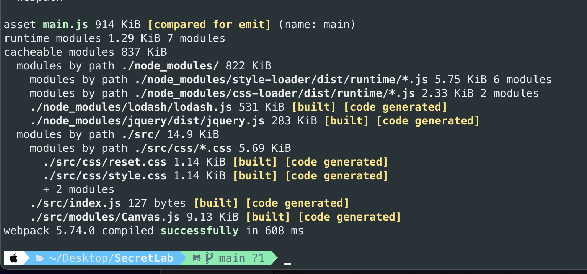

# SecretLab

## Instance Installation 
Clone this repository and simply access to `index.html` under `dist`. 
This assignment is backed by webpack which is a module bundler for javascript. 

## Bundling the project
### Prerequisite
You will need use npm to download the require node module. As per requirement, this technical test is depended on only two packages as follow: 

```js
"dependencies": {
    "jquery": "^3.6.1",
    "lodash": "^4.17.21"
  }
```

Once you cloned this repo, you can use following command to download require assets

```shell
npm install
```

### How to bundle (export) the file after making changes
By default, when you make changes in `Canvas.js`, `index.js`, `reset.css` and `style.scss`, you will not see the instance update.
The files that is accessed by `dist/index.html`, which is `dist/main.js`, is exported by following configuration of webpack.

```js
output: {
    filename: 'main.js',
    path: path.resolve(__dirname, 'dist'),
},
```
After you make any changes in `Canvas.js`, `index.js`, `reset.css` and `style.scss`, please run following command to export the assets

```shell
npm run build
```
If you see the following output, then it is successfully bundled and exported. 

