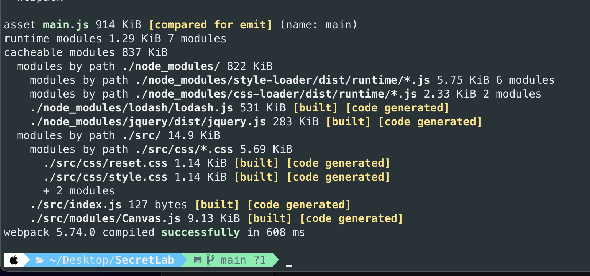
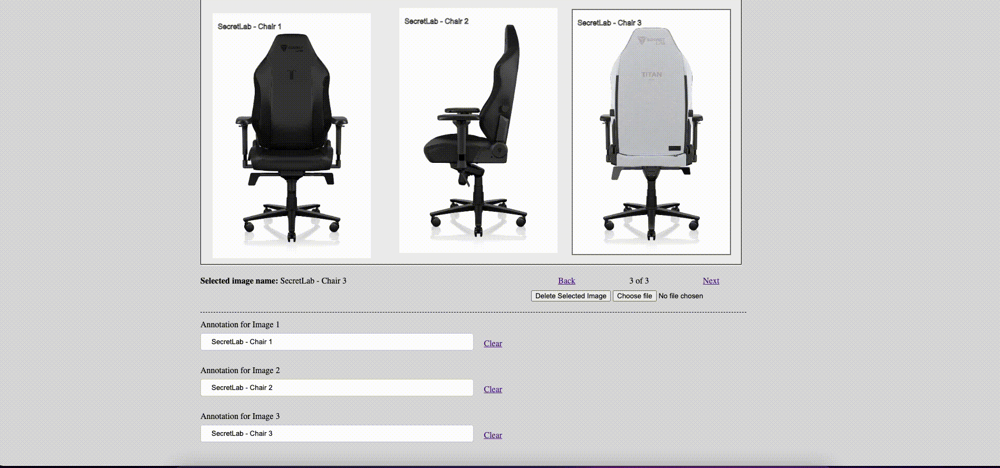
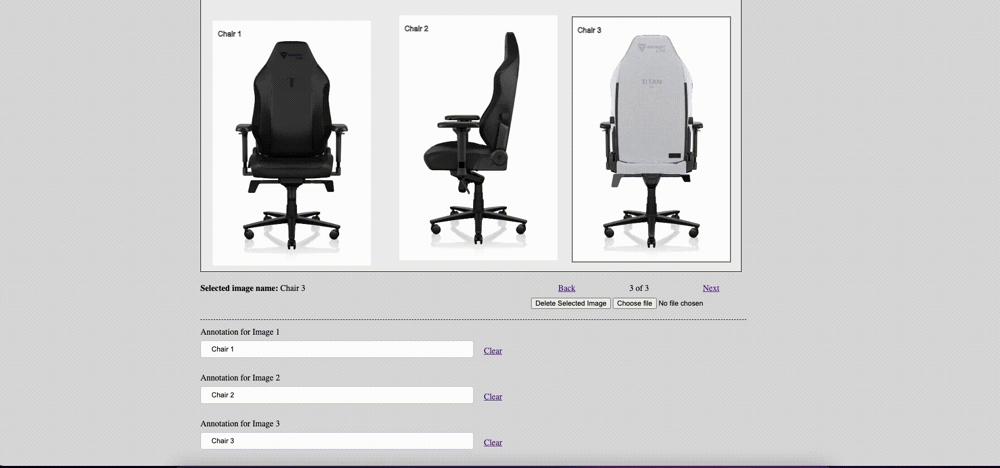

# SecretLab

## Instance Installation 
Clone this repository and simply access to `index.html` under `dist`. 
This assignment is backed by webpack which is a module bundler for javascript. 

## Bundling the project
### Prerequisite
You will need use npm to download the require node module. As per requirement, this technical test is depended on only two packages, which are: 

```js
"dependencies": {
    "jquery": "^3.6.1",
    "lodash": "^4.17.21"
  }
```

Once you cloned this repository, you can use following command to download require assets

```shell
npm install
```

### Accessing Development Environment
By default, when you make changes in `Canvas.js`, `index.js`, `reset.css` and `style.scss`, you will not see the instance update in your browser.
The files that is accessed by `dist/index.html`, which is `dist/main.js`, is exported by following configuration of webpack.

```js
output: {
    filename: 'main.js',
    path: path.resolve(__dirname, 'dist')
},
```
After you make any changes in `Canvas.js`, `index.js`, `reset.css` and `style.scss`, please run following command to export the assets

```shell
npm run build
```
If you see the following output, then it is successfully bundled and exported. 


### Project Structure Overview
    .
    ├── dist                    # Compiled files
    ├──── images                # Images for testing and development purpose. You can use this to test as well.
    ├── node_modules            # You will see this after you performed `npm install`
    ├── readme-access           # Read me assets
    ├── src                     # Source files
    ├──── css                   # Source files
    ├──── modules               # All releated modules
    ├──── index.js              # This is where all module are bind together
    ├── .gitignore
    ├── .package.json
    ├── .package-lock.json
    ├──  README.md
    └── webpack.config.js       # Webpack configuraiton

## Features
### Local Storage Implementation
- The application is tightly tied with browser side storage, (i.e) local storage.
- Because of this, when a user makes changes in the current session and reloads the page, it will automatically retrieve the last state of images. This includes changes to annotations and positions.


### Upload and drag photos

- User can upload photo and drag around the canvas. To maximise the performance, it only allow <b>five</b> photos to upload.
- User can drag and drop the photos around the canvas

### Handling for different screen size

- This viewport limited to perform 1030px and above for maximum performance.

### Alter Image Annotations

- Allow user to alter the annotation for each image.

- Allow user to clear the annotation for each image

### Deletable

- Allow User to delete the selected image.
- If there is nothing to delete, it will prompt an alert

### Limitations

- When image are overlap each other , it is hard to detect which image is dragging. The javascript need to detect the overlapping and intersection points for images
- If we handle the canvas from css, the image is distorted. Because of that the canvas size is fixed at 1024. 
- It is the best that if we can implement the unit testing with frontend test framework , like jest.
